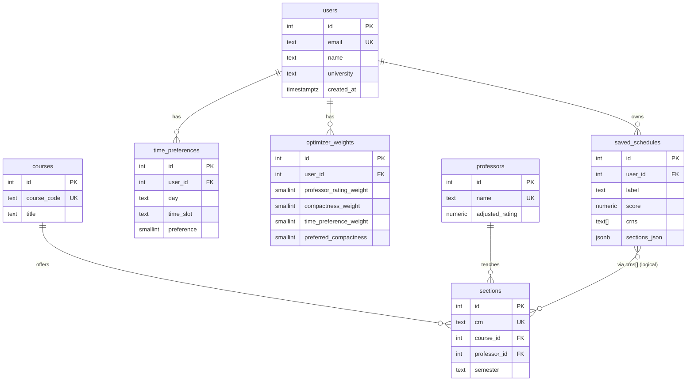

# Coursely

**Coursely** helps Georgia State University students build **conflict-free** semester schedules from real **course section** data, rank them with a **weighted multi-criteria score** (professor ratings, compactness, time preferences), and **save** favorites. The app is a **React** front end talking to a **FastAPI** + **PostgreSQL** backend.

---

## Overview

| Piece | What it does |
|--------|----------------|
| **Optimizer** | Pick courses, set a weekly time-preference grid and weights, **generate** ranked schedules (list/calendar, export `.ics`). |
| **Saved schedules** | Persist chosen schedules (CRNs + score snapshot) — rename, delete. |
| **Analytics** | Read-only SQL-backed views: saved-schedule comparison, CS fill rates, professor stats by department. |
| **Data** | Courses/sections/professors come from scraping; professor ratings are enriched from RateMyProfessor-style data. |

A default **`users`** row (`id = 1`) owns preferences and saved rows; there is **no login UI** — it keeps the demo simple while the schema is ready for real auth later.

---

## Tech stack

- **Frontend:** React (Vite), Tailwind CSS, React Router  
- **Backend:** Python 3, FastAPI, **psycopg2** (raw SQL)  
- **Database:** PostgreSQL  
- **Tooling:** `backend/db/run_migration.py` for schema setup

---

## Prerequisites

- **Node.js** (for the frontend)  
- **Python 3.10+**  
- **PostgreSQL** running locally or remotely  

---

## Quick start

### 1. Clone and configure the database

Create a database (e.g. `coursely`), then copy environment variables:

```bash
cp .env.example .env
```

Edit **`.env`** with your real `DB_HOST`, `DB_PORT`, `DB_NAME`, `DB_USER`, and `DB_PASSWORD`.

### 2. Apply the schema

From the **`backend`** folder:

```bash
cd backend
pip install -r requirements.txt
python db/run_migration.py
```

This runs the additive SQL migrations (including **`users`** and foreign keys). It prints which database it connected to — use the same database in tools like DBeaver.

For a **fresh** empty database you can also execute `backend/db/schema.sql` manually if you prefer.

### 3. Run the API

Still in **`backend`**:

```bash
uvicorn app.main:app --reload --host 0.0.0.0 --port 8000
```

API base: `http://localhost:8000` — interactive docs at `http://localhost:8000/docs`.

### 4. Run the frontend

In another terminal:

```bash
cd frontend
npm install
npm run dev
```

Vite proxies **`/api`** → `http://localhost:8000`, so open the URL Vite prints (usually `http://localhost:5173`).

### 5. (Optional) Load course data

Populate **`courses`**, **`sections`**, and **`professors`** using the scrapers under `backend/scraper/` once your DB is up. Without section data, schedule generation will return no results.

---

## Mathematical modeling (schedule generation)

The generator does **not** use a single SQL query for ranking. It:

1. **Enumerates** combinations — one section per requested course — via a Cartesian product (with a **maximum combination cap** to avoid huge searches).  
2. **Filters** — drops any pair of sections that **overlap in time** on a shared weekday.  
3. **Disqualifies** — if the user marked an **“avoid”** time cell and a class occupies that slot, the whole schedule is rejected.  
4. **Scores** each surviving schedule with three subscores in roughly **[0, 1]**, then a **weighted sum** \(w_1 + w_2 + w_3 = 1\):

   | Subscore | Idea |
   |----------|------|
   | **Professor** | Average of per-section **`adjusted_rating`** (Bayesian-smoothed RMP-style signal); missing ratings fall back to a global mean. |
   | **Compactness** | Per day: compare **gap time** vs **campus span**; average across days; match the user’s **preferred compactness** slider. |
   | **Time preference** | Average grid preference values (e.g. prefer / okay) over occupied slots; **avoid** = hard fail. |

5. Converts the weighted sum to a **0–100** style score for the UI and returns the **top K** schedules.

Details live in `backend/app/services/scheduler.py`.

---

## Database schema (summary)

| Table | Role |
|-------|------|
| `users` | Optional identity; default user `id = 1` for demo. |
| `professors` | Name, RMP fields, `adjusted_rating`, `department`, … |
| `courses` | Catalog: `course_code`, title, … |
| `sections` | Offerings: CRN, semester, times, `course_id`, `professor_id`, capacity, enrolled. |
| `time_preferences` | Per `(user_id, day, time_slot)` → preference code (avoid / okay / prefer). |
| `optimizer_weights` | Per user: three weights summing to 100 + preferred compactness. |
| `saved_schedules` | User’s saved result: label, term, score, `crns[]`, subscores, optional `sections_json` snapshot. |

Authoritative DDL: **`backend/db/schema.sql`**.  
Migrations: **`backend/db/migrate_additive.sql`**, **`backend/db/migrate_users_fk.sql`**.

---

## ER diagram (conceptual)



*Saved schedules link to sections in application/SQL by **unnesting `crns`** and joining to `sections.crn`, not a classic FK from `saved_schedules` to `sections`.*

---

## API surface (high level)

| Area | Prefix | Examples |
|------|--------|----------|
| Schedules | `POST /schedules/generate` | Generate ranked schedules |
| Saved | `/saved-schedules` | CRUD on saved rows |
| Analytics | `/analytics/...` | Aggregates for dashboards |
| Preferences | `/preferences/...` | Time grid + weights persistence |
| Health | `GET /health` | Liveness |

Full list: **`/docs`** when the server is running.

---

## Project layout

```
Coursely/
├── .env.example          # Copy to .env
├── backend/
│   ├── app/              # FastAPI routes, services, models
│   ├── db/               # connection, schema.sql, migrations, run_migration.py
│   └── scraper/          # GSU + RMP data ingestion
├── frontend/
│   └── src/              # React pages & components
└── README.md             # This file
```

---

## License

[Add your license if applicable.]
